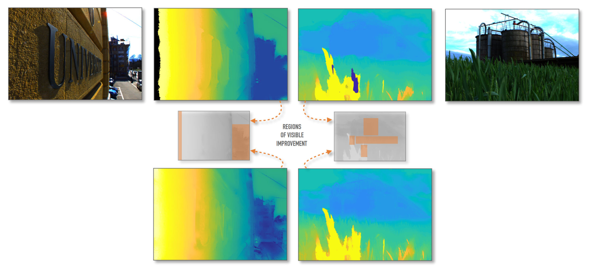

# Cost Refinement
<div align="center">
  <h4><a href="https://www.cg.tuwien.ac.at/research/publications/2021/cardoso-2021-cost">Website</a> | <a href="https://ieeexplore.ieee.org/document/9412730">Paper</a></h4>
</div>



**Cost Volume Refinement for Depth Prediction**  
[Joao Liborio Cardoso](jaliborc.com), [Nuno Gonçalves](https://ieeexplore.ieee.org/author/37281864700), [Michael Wimmer](https://www.cg.tuwien.ac.at/staff/MichaelWimmer)  
In 2020 25th International Conference on Pattern Recognition (ICPR)

*Light-field cameras are becoming more popular in the consumer market. Their data redundancy allows, in theory, to accurately refocus images after acquisition and to predict the depth of each point visible from the camera. Combined, these two features allow for the generation of full-focus images, which is impossible in traditional cameras. Multiple methods for depth prediction from light fields (or stereo) have been proposed over the years. A large subset of these methods relies on cost-volume estimates – 3D objects where each layer represents a heuristic of whether each point in the image is at a certain distance from the camera. Generally, this volume is used to regress a depth map, which is then refined for better results.*

*In this paper, we argue that refining the cost volumes is superior to refining the depth maps in order to further increase the accuracy of depth predictions. We propose a set of cost-volume refinement algorithms and show their effectiveness.*

## Contents
Contains the minimum necessary matlab code to run our proposed artifact removal and local smoothness cost volume refinement methods. Two demo functions are provided:

* `predictDepth.m` -  refines cost and performs parabolic prediction, as used in our tests  
* `refineCost.m` - returns a new refined cost volume

Code for our refinement functions can be found under `api/priors/`. Artifact removal implemented using [Jeon et al. 2015](https://www.cv-foundation.org/openaccess/content_cvpr_2015/papers/Jeon_Accurate_Depth_Map_2015_CVPR_paper.pdf) graph cuts as the classifier, with code taken from https://github.com/Vincentqyw/Depth-Estimation-Light-Field, which is included in the repository.

## Citation
If you use this code for your research, please cite our paper:
```
@inproceedings{cardoso2021cost,
  title={Cost Volume Refinement for Depth Prediction},
  author={Cardoso, Jo{\~a}o L and Gon{\c{c}}alves, Nuno and Wimmer, Michael},
  booktitle={2020 25th International Conference on Pattern Recognition (ICPR)},
  pages={354--361},
  year={2021},
  organization={IEEE}
}
```
